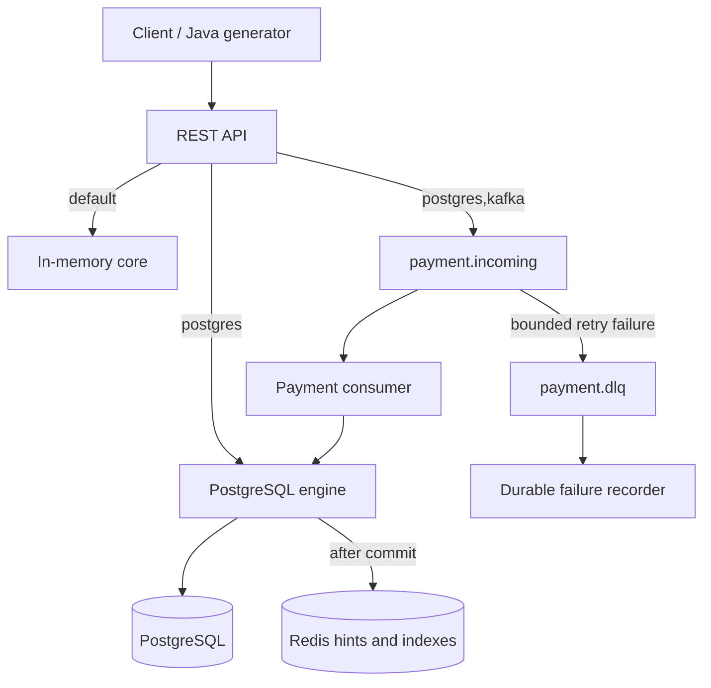

# Architecture

The backend is one modular Spring Boot application. Controllers use `RtgsEngine`. The default adapter composes the in-memory payment, liquidity, queue, and gridlock modules. The `postgres` adapter reads durable rows for every financial decision. The Kafka adapter changes submission transport and delegates durable work to PostgreSQL. Redis remains optional.

Domain records are immutable and money uses signed 64-bit minor units with positive-payment/nonnegative-balance validation. Arithmetic uses exact integer operations; overflow is rejected before committing effects.

`participants`, `liquidity_positions`, `payments`, `settlements`, and `processing_failures` are durable tables. `settlements.payment_id UNIQUE` and `available_minor >= 0` are mandatory final constraints. PostgreSQL wins whenever a cache disagrees with durable state. Queue membership is derived from payment status rather than an independent durable queue table.

Java locks reduce local contention. Sorted database row locks serialize financial updates across independent engine instances. Read APIs query durable state in the PostgreSQL profile. Successful batches commit their balances, records, and statuses together.

The early infrastructure-first attempt had no files in the supplied workspace when inspected. This implementation preserved all files it found; it did not delete earlier work. The revised phase order and detailed gates are in implementation-status.md and phase-reports.md.

Scope is a single-currency simulation. Authentication, distributed microservices, Kubernetes, full ISO 20022/SWIFT, and additional observability platforms are outside this project's handoff.
